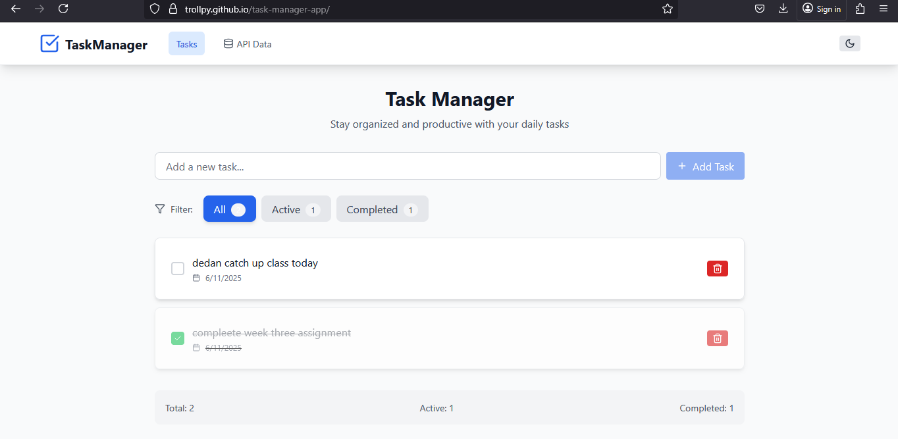
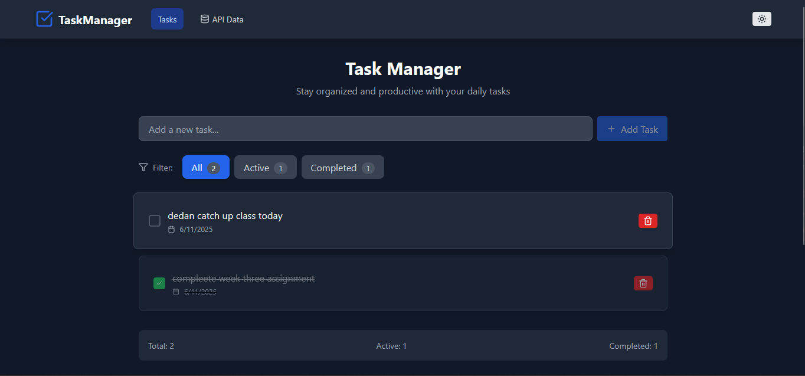
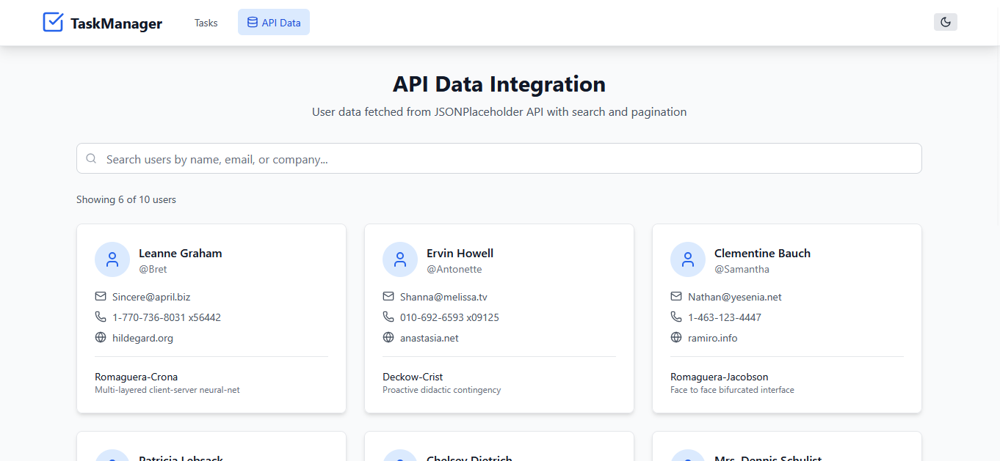
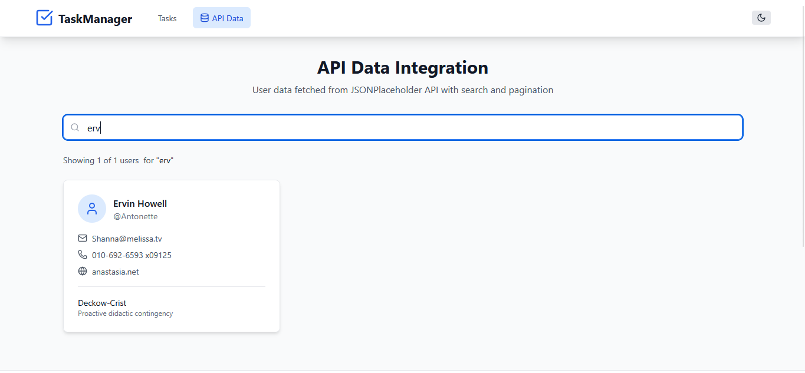

# Task Manager App

A modern, responsive task management application built with React, Vite, and Tailwind CSS. This application provides an intuitive interface for managing tasks with additional API data integration capabilities.

## 🚀 Live Demo

**[View Live Application](https://trollpy.github.io/task-manager-app/)**

## 📱 Application Screenshot







## ✨ Features

- **Task Management**: Create, edit, delete, and organize tasks efficiently
- **Responsive Design**: Optimized for desktop, tablet, and mobile devices
- **Dark/Light Theme**: Toggle between dark and light modes for better user experience
- **API Integration**: Dedicated page for API data visualization and management
- **Modern UI**: Clean, professional interface built with Tailwind CSS
- **Fast Performance**: Built with Vite for optimal build times and development experience

## 🛠️ Technologies Used

- **Frontend Framework**: React 19.1.0
- **Build Tool**: Vite 6.3.5
- **Styling**: Tailwind CSS 3.3.5
- **Routing**: React Router DOM 7.6.2
- **Development**: ESLint for code quality
- **Deployment**: GitHub Pages

## 🏗️ Project Structure

```
task-manager-app/
├── public/
├── src/
│   ├── components/
│   ├── contexts/
│   ├── pages/
│   ├── App.jsx
│   ├── main.jsx
│   └── index.css
├── package.json
├── vite.config.js
└── README.md
```

## 🚀 Getting Started

### Prerequisites

- Node.js (version 14 or higher)
- npm or yarn package manager

### Installation

1. **Clone the repository**
   ```bash
   git clone https://github.com/trollpy/task-manager-app.git
   cd task-manager-app
   ```

2. **Install dependencies**
   ```bash
   npm install
   ```

3. **Start the development server**
   ```bash
   npm run dev
   ```

4. **Open your browser**
   Navigate to `http://localhost:5173` to view the application

### Building for Production

```bash
npm run build
```

The build artifacts will be stored in the `dist/` directory.

### Deployment

This project is configured for GitHub Pages deployment:

```bash
npm run deploy
```

## 🔧 Configuration

### Vite Configuration

The project uses a custom Vite configuration optimized for GitHub Pages deployment:

```javascript
// vite.config.js
import { defineConfig } from 'vite'
import react from '@vitejs/plugin-react'

export default defineConfig({
  plugins: [react()],
  base: '/task-manager-app/',
})
```

### Routing

The application uses HashRouter for compatibility with GitHub Pages static hosting:

- Home/Tasks: `/#/` or `/#/tasks`
- API Data: `/#/api-data`

## 📦 Available Scripts

- `npm run dev` - Start development server
- `npm run build` - Build for production
- `npm run preview` - Preview production build
- `npm run lint` - Run ESLint
- `npm run deploy` - Deploy to GitHub Pages

## 🎨 Styling

The application uses Tailwind CSS for styling with:
- Responsive design utilities
- Dark mode support
- Custom color schemes
- Smooth transitions and animations

## 🔒 Browser Compatibility

- Chrome (latest)
- Firefox (latest)
- Safari (latest)
- Edge (latest)

## 📈 Performance Features

- Code splitting with React Router
- Optimized asset bundling with Vite
- Efficient CSS with Tailwind's purge functionality
- Fast refresh during development

## 🤝 Contributing

I welcome contributions to improve this task manager application. Please feel free to:

1. Fork the repository
2. Create a feature branch
3. Make your changes
4. Submit a pull request

## 📄 License

This project is open source and available under the [MIT License](LICENSE).

## 👨‍💻 Developer

**Trollpy**
- GitHub: [@trollpy](https://github.com/trollpy)
- Project Repository: [task-manager-app](https://github.com/trollpy/task-manager-app)
